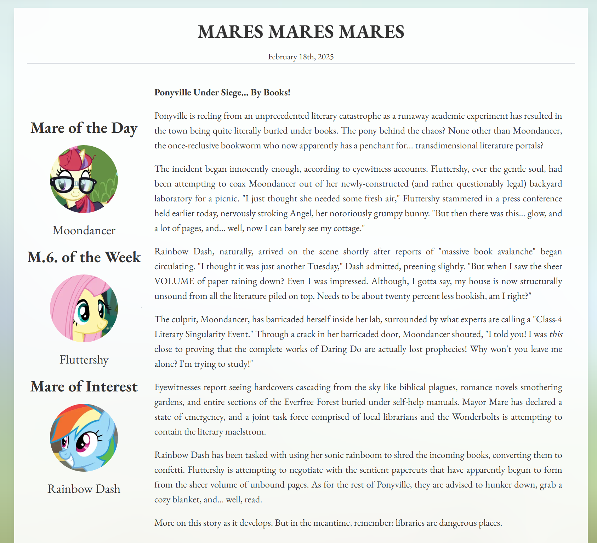

[Small weekend project website](https://www.mare-of-the-day.com/). Shows random 'mares of the day' from various
categories + AI generated news stories + random episodes, using openrouter
(needs API key and define a random `MARES_SEED` in `.env`).

